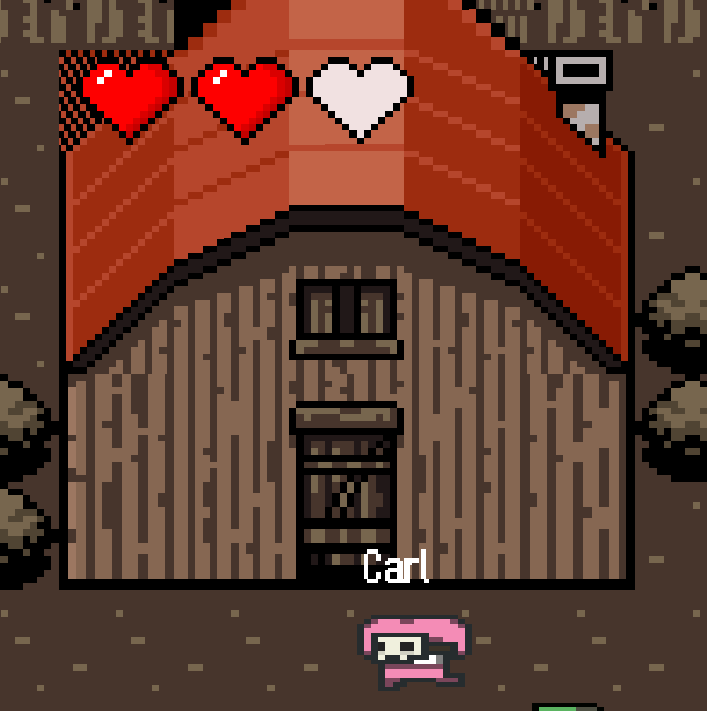

## Overview
In "Dead City Chronicles," the world has changed. What was once a bustling city is now a quiet, dangerous labyrinth. Where lively streets once stood, now there are only the sounds of shuffling zombies and hidden dangers waiting for the unwary. Your mission is to collect all the keys to escape while either evading the blood-thirsty zombies or neutralizing them with vaccines.

Once you have collected all the keys, you must retreat back to this house in order to win the game.


## Game trailer
Our game [video demo](https://www.youtube.com/watch?v=lvh7uye36d4)

## Instructions
First, navigate to the root directory: "phase2". In the terminal, type the following commands to build, run, and test the game

### Building the Game
```
mvn clean install
```
### Running the Game
```
java -cp .\target\phase2-1.0-SNAPSHOT.jar com.group22.Main
```
### Testing the Game
```
mvn clean test
```
### Generating Jacoco test result
```
mvn jacoco:prepare-agent test install jacoco:report
```
The test result is located in `target\site\jacoco\index.html`

### Javadocs
``` 
mvn javadoc:javadoc
```
Javadocs are located in `phase2\target\site\apidocs`

## Resources
Java 2D Game Tutorial - [RyiSnow](https://www.youtube.com/@RyiSnow/featured)<br>
[Character design](https://0x72.itch.io/pixeldudesmaker)<br>
[Map sprite pack](https://ittaimanero.itch.io/zombie-apocalypse-tileset)<br>
[Syringe sprite](https://www.pixilart.com/art/syringe-02aaad1d2f3eba1)<br>
[Heart sprite](https://unreached-lands.itch.io/lifebar-pixelart-sprites-16x16)<br>
[Key sprite](https://dustdfg.itch.io/pixel-art-keys)<br>
[Sound effect](https://pixabay.com/)<br>
Background music - The Walking Dead TV show

## Acknowledgement
This project is done in collaboration with Nancy Wang, Sina MohammadiNiyaki, and Derek Huang for CMPT 276 (Introduction to Software Engineering) Project

